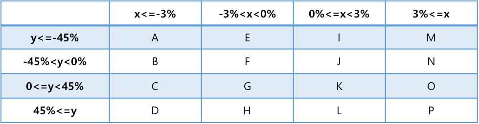

Trade Prediction 
=======
### 주가를 예측하여 실제 trading system에서 이득을 얻을 수 있는 프로그램을 구현한다.

#### Implementation
- Language: C
- Tool: Visual Studio 2010
- Duration: 1 month

### Process
[1. Training Program](#1-training-program)

[2. Trading Program](#2-trading-program)

## 1. Training Program
주어진 Tick data를 이용하여 주식의 상승과 하락을 일으키는 **패턴과 신호**를 찾는다.
> 제공된 데이터
>	```
>	약 15개 회사의 100일 간 주식변화를 기록해 놓은 Tick data
>	1개의 txt파일당 하루치 변화 기록 -> 총 1500개의 파일
>	> Form: CODE/ DATE/ TIME/ PRICE/ VOLUMNE/ x /
>	```

나는 급증 전에 사서 급증 후 팔거나, 급락 전에 팔아서 급락 후 사야 손해를 줄이고 최대 이익을 낼 수 있다고 판단하였다. 

따라서, 회사별 주식변화 패턴을 찾기 위해 각 회사의 주식거래의 변화를 문자열로 표현하여, 급락 또는 급증한 시점을 기점으로 공통적인 변화를 관찰하여 패턴을 찾을 것이다.
<p align="center">
	</img>
	</img>
</p>

### 알고리즘
1. 회사 별로 각 day에 대한 평귝 가격과 volume을 구하고, 아래와 같은 룰을 적용하여 100일 간의 주식변화를 **하나의 string**으로 표현하였다.
<p align="center">
	</img>
	<br>x: rate of price change compare to the previdous day<br>y: rate of volume change compare to the previous day
</p>

2. 구한 string에서 문자 A, B, C, D (주식 급락한 날) 또흔 문자 M, N, O, P(주식 폭등한 날)이 나왔을 때 해당 문자 앞 8자를 자른다.

3. 2번을 통해 구한 집합에서 패턴을 찾기 위해 [**LCS 알고리즘**](https://en.wikipedia.org/wiki/Longest_common_subsequence_problem)을 사용한다.

4. 3번을 통해 여러 개의 패턴이 나오면, 그 중 문자열의 길이가 가장 긴 것을 찾아 선택한다.

4. 결과적으로, 각 회사당 2개의 패턴을 찾았다. (급증 전 패턴, 급락 전 패턴) 아래 캡쳐는 본 알고리즘으로 찾은 각 회사별 패턴을 의미한다.
<p align="center">
	</img>
</p>

## 3. Trading Program

### 시스템 구조
<p align="center">
	</img>
</p>

```
Tick-Signal: client가 server에게 tick data를 요청, client는 end-signal을 받을 때까지 계속 tick-signal 전송
End-Signal: client에게서 tick을 요구 받았을 때, 더 이상 전달한 Tick이 없을 때 전송
One Tick: client에게 tick 1개 보내줌 (Form: CODE/DATE/TIME/PRICE/VOLUME/x)
Transaction-Signal: client가 거래(사거나 팜)을 결정하면, client가 server에게 거래신호를 보냄 (Form: CODE/ B or S/ amount)
```

### 알고리즘
Traing Program을 통해 얻은 패턴으로 **급락, 폭등 전에 미리 주식을 알맞게 거래**할 수 있다. 즉, 곧 급락할 것이라는 패턴이 보이면 미리 주식을 팔고, 급락했을 때 다시 사면 이익을 얻을 수 있다. 반대로, 곧 폭등할 것이라는 패턴을 보였을 때 미리 주식을 사놨다가, 폭등했을 때 팔면 최대 이익을 남길 수 있다.

따라서, 나는 각 회사별로 데이터를 나눠 모으고, 1일 단위로 Tick data의 평균값을 구하여, training program에서와 같이 전 날과 비교하여 문자로 표현한다.

변화를 기록해놨다가 해당 회사의 급감 패턴 또는 급증 패턴과 80% 일치하면 그에 맞는 거래를 한다.
아래 캡쳐는 거래 내역을 기록한 내용이다.
<p align="center">
	</img>
</p>

### 결과
트레이닝을 위해 미리 제공해준 데이터로 실험한 결과, 10,000,000원으로 시작하여 마지막 거래 후 약 12,000,000원을 남겼다. (수익: 약 20%)

하지만, 데모 시에는 오히려 손해를 보았다. 아무래도 주어진 데이터에 너무 최적화 하여 training을 시킨 것 같다.
